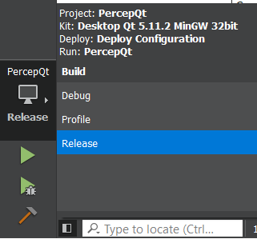

# Qt_Deployment
There are several tools and ways for the deployment of Qt for now. Since the [linuxdeployqt](https://github.com/probonopd/linuxdeployqt) requires a earlier version of linux system such as Ubuntu 14.0 to deploy Qts,
I've been using [CQt Deployer](https://github.com/QuasarApp/CQtDeployer) to deploy the Qt for now. The method I'm using was to create an installer for the application so that when switching to a new device, installation should be done.

The following are the steps:

## 1. Release in Qt:
When finishing editing the Qt, change from the **Debug** mode to the **Release** mode. (Graph) Then build and run it.


## 2. Install CQt Deployer by snap:

```
$sudo snap install cqtdeployer
```

## 3. Utilizing cqtdeployer:
https://github.com/QuasarApp/CQtDeployer

```c
// cd to the Release directory that Qt created
$cd build-PercepQt-Desktop_Qt_........-Release
// cqtdeployer , the project name should be changed and the directory should also be changed
$cqtdeployer -bin PercepQt -qmake ~Qt/5.11.2/gcc_64/bin/qmake -qmlDir ./

// for linux
$cd .. //cd to Release directory
$cqtdeployer -bin Application qif
```

## 4. Install before use:
When switching to another computer, simply copy the project folder and then install
```c
$cd DistributionKit
//Changing the authority to run the .run file
$chmod +x InstallerPercepQt.run
//Install and run the File
```
Then follow the steps to install.


## 5. Run!!!:
After installation, cd to the file you installed and run the .sh file.
```c
$cd ~PercepQt/PercepQt
$./PercepQt.sh
```
